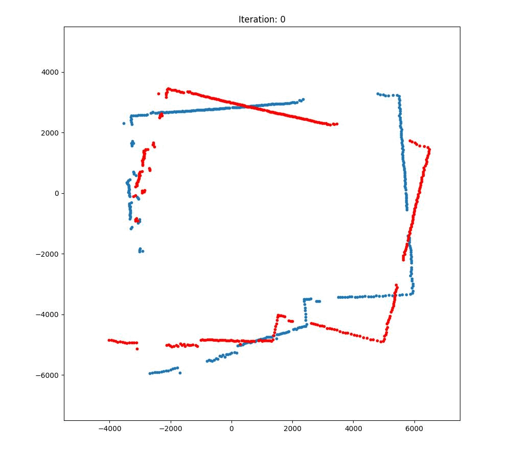

## A Probabilistic Approach to Iterative Closest Point Algorithm

This repository contains code for an approach taken on the ICP algorithm from a probabilistic point of view. The sake of proof of concept and demostration, the method has been validated on a 2D point set. However, extending this to 3D scan-matching and coupling with a state-estimator such as a Kalman Filter is accurate localization via this approach is definitely in my futrue plans for this project.  
<p align="center">
 
</p>

### Learn More About This
Do check out my [Medium post](https://medium.com/@mhamdaan/a-probabilistic-approach-to-the-iterative-closest-point-algorithm-78092928555c) where I explain about this approach in detail. I also give a brief but solid introduction on the Iterative Closest Point Algorithm, its types, and solving techniques before I jump into the crux of the matter. 

### The Code
The code comes with a point cloud (.pcd) file of a room scan in the data/ directory. The code and the approach has been validated on this toy dataset. 

#### Dependencies
Instaltion commands as per Ubuntu, Debian systems. 
1. Eigen C++ `sudo apt install libeigen3-dev` 
2. PCL (Point Cloud Library) `sudo apt install libpcl-dev`

#### Compiling the Code

```
git clone git@github.com:hamdaan19/probabilistic_ICP.git
mkdir probabilistic_ICP/build && cd probabilistic_ICP/build
cmake ..
make
```

First prepare your data by running the src/transform_cloud.cpp . This file transforms room.pcd into a new cloud to emulate to different scans taken from two different POVs. 
`cd build && ./transform`

<b>Perform Scan Matching</b>
```
cd build && ./scan_matching_2d true|false #bool arg for logging optimizer data. Default: false 
```


